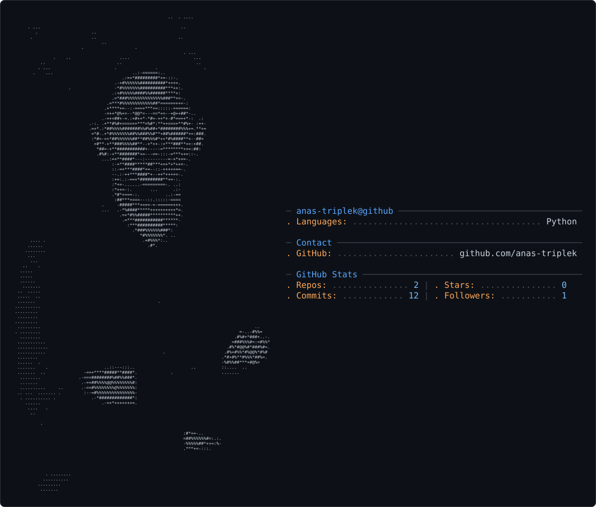

<picture>
  <source media="(prefers-color-scheme: dark)" srcset="dark_mode.svg" />
  <source media="(prefers-color-scheme: light)" srcset="light_mode.svg" />
  
</picture>

👋 Hi, I'm Anas

💻 Software Engineer | Python | Django | FastAPI | React

Software Engineer with 3+ years of experience building full stack web
applications using Python, Django, Django REST Framework, FastAPI, and
React.js. I have hands on experience developing scalable backend systems,
APIs, databases, and responsive frontend interfaces with a strong focus on
clean architecture and production ready solutions.

I hold a BS in Software Engineering with a strong foundation in computer
science, object oriented programming, and web development. I enjoy turning
ideas into practical products, solving complex problems, and building
software that delivers real impact.

My core skills include Python, Django, FastAPI, React.js, JavaScript, C++,
Java, HTML, CSS, MySQL, PostgreSQL, Azure, GitHub Actions, and API
development. I am particularly interested in backend engineering, full
stack product development, and building meaningful technology using modern
software and AI driven solutions.

I am always open to connecting with developers, founders, and teams working
on exciting technology and impactful products.

🚀 What I Work With
• Python
• Django
• FastAPI
• React.js
• JavaScript
• C++
• Java
• HTML & CSS
• MySQL
• PostgreSQL
• Azure
• GitHub Actions
• API Development

📌 Currently Working On
...

📂 Featured Projects
...

📫 Let's Connect
...
